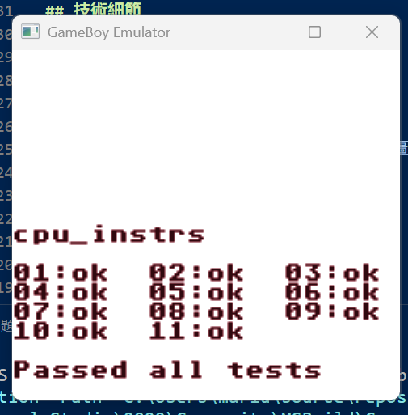
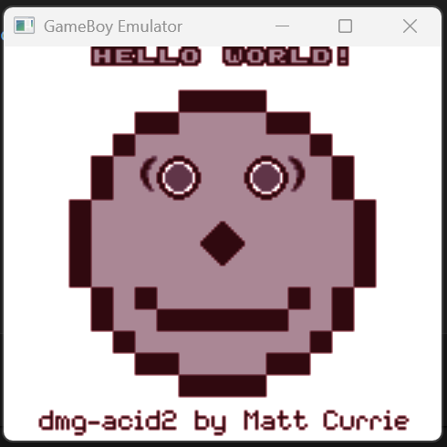
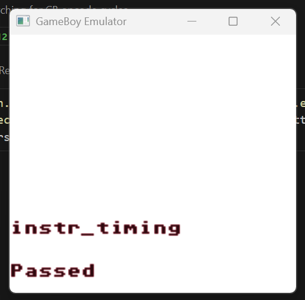
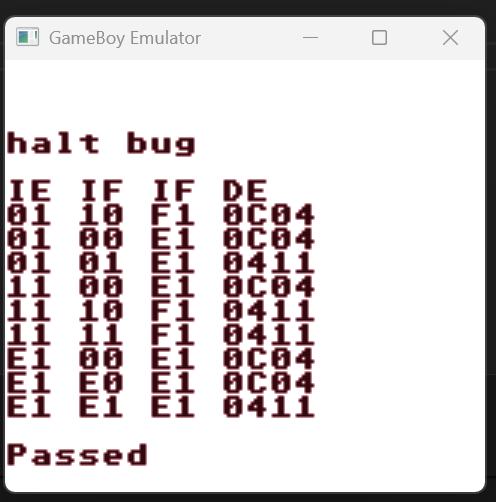

# GameBoy Emulator (A.I Project, Not Complete)

> 一個用 C++ 與 SDL3 撰寫的 Game Boy (DMG) 模擬器。現已通過 blargg `cpu_instrs` 全部測試，`dmg-acid2` 圖像測試亦已正確顯示。

## 狀態總覽
| 子系統 | 現況 |
|--------|------|
| CPU | 指令集、旗標、EI 延遲、中斷優先順序與服務流程已通過 `cpu_instrs.gb` 全部項目 |
| PPU | 掃描線/Mode 時序 (456 cycles/line)、背景/視窗/Sprite 渲染皆正常；`dmg-acid2` 已通過（含右下 Window/遮蔽/優先序） |
| APU | 新表驅動架構已上線；通過 `01-registers.gb`，`02-len ctr.gb` 正在實作長度計數器/狀態位細節 |
| MMU | 寄存器、IF/IE、Timer (DIV/TIMA/TMA/TAC)；已實作 CPU 端 VRAM/OAM 忙碌鎖定，並提供 `ppu_read` 供 PPU 在 Mode2/3 期間合法讀取 |
| 測試 | blargg `cpu_instrs`：Passed all tests；`dmg-acid2`：Passed |

## 已知待辦 / 未完成
1. **Memory 時序（mem_timing 測試）**：當前實現一次性執行整個指令（包括參數讀取與執行），不符合 Game Boy 硬體的 M-cycle 精確分解。解決此問題需要重構 CPU 執行引擎以實現基於 M-cycle 的微操作系統。
2. 精細像素 FIFO 與 SCX 捲動延遲、STAT 中斷精準觸發點（acid2 已過，但為提升相容性仍建議實作）。
3. APU：
  - 長度計數器（`NRx1`/`NRx4` bit6）與 `NR52` 狀態位（NW21）完全對齊 Pandocs（`02-len ctr` 進行中）。
  - 包絡/掃頻/頻率計時器與觸發副作用（`03` 以後測試）。
4. 減少除錯輸出：以 compile-time 或 runtime 旗標控制（避免影響效能）。

## 主要技術特性
- C++20 (原始 README 標示 C++14，現已升級並使用現代語言特性)。
- SDL3：顯示與音訊輸出。
- 精簡 PPU 模式循環：
	- 每行 456 cycles：0–79 (Mode2 OAM)，80–251 (Mode3 Pixel Transfer)，252–455 (Mode0 HBlank)。
	- LY 0–143 可視行；144–153 VBlank (Mode1)；154 重設。
- CPU 中斷：服務 5 M-cycles（2 wait + push PC 高/低 + 跳轉），EI 延遲一指令生效。
- Sprite：OAM 原始順序選前 10 個；支援 8x16、Flip、背景優先 (color0 透明 + 背景非 0 隱藏 behind_bg)。

## 專案結構
```
GameBoy/
├── main.cpp              # 入口
├── CMakeLists.txt        # CMake 配置
├── include/              # 標頭
│   ├── cpu.h / mmu.h / ppu.h / apu.h / emulator.h
├── src/                  # 實作檔
│   ├── cpu.cpp / mmu.cpp / ppu.cpp / apu.cpp / emulator.cpp
├── roms/                 # 測試與範例 ROM (acid2, cpu_instrs, tetris 等)
├── build/                # CMake 產物 (生成後)
│   ├── Debug/            # Debug 輸出
│   └── Release/          # Release 輸出
└── README.md             # 此檔案
```

## 編譯與執行
### Windows 前置需求
- Visual Studio 2022（含 C++ 桌面開發）或 MSVC 工具鏈
- CMake 3.25+（VS 內建或獨立安裝皆可）
- SDL3 執行階段（`SDL3.dll`）

取得 SDL3 的常見做法：
- 使用 vcpkg（建議）
  1) 安裝 vcpkg 並 `vcpkg integrate install`
  2) 安裝套件：`vcpkg install sdl3:x64-windows`
  3) CMake 指定 toolchain（選用）：
     ```powershell
     cmake -S . -B build -DCMAKE_TOOLCHAIN_FILE=$env:VCPKG_ROOT\scripts\buildsystems\vcpkg.cmake -DVCPKG_TARGET_TRIPLET=x64-windows
     ```
  4) 執行時請確保 `SDL3.dll` 能被找到（通常在 `vcpkg\installed\x64-windows\bin\SDL3.dll`）；可將其複製到 `build\Debug` 同層。
- 直接下載官方二進位（可攜式）
  1) 到 SDL 官方 Release（libsdl-org/SDL）下載 Windows x64 zip
  2) 將 `SDL3.dll` 解壓後放到 `build\Debug`（或加入到 PATH）

### CMake (推薦)
```powershell
# 從專案根目錄
cmake -S . -B build
cmake --build build --config Debug
# 執行
.\build\Debug\GameBoy.exe .\roms\cpu_instrs.gb
.\build\Debug\GameBoy.exe .\roms\dmg-acid2.gb
.\build\Debug\GameBoy.exe .\roms\tetris.gb
# APU 測試（檔名含空白請加引號）
.\build\Debug\GameBoy.exe ".\roms\01-registers.gb"
.\build\Debug\GameBoy.exe ".\roms\02-len ctr.gb"
```

### Visual Studio (可選)
1. 開啟 `CMakeLists.txt` 作為 CMake 專案。
2. 設定組態 `Debug | x64`。
3. 建置後執行：
```powershell
.\build\Debug\GameBoy.exe .\roms\cpu_instrs.gb
```

## 按鍵映射

模擬器使用以下鍵盤按鍵映射到 Game Boy 控制器：

- **A**: A 鍵
- **B**: S 鍵
- **Start**: Enter 鍵
- **Select**: Space 鍵
- **方向鍵**:
  - ↑: 上方向鍵
  - ↓: 下方向鍵
  - ←: 左方向鍵
  - →: 右方向鍵

確保模擬器窗口聚焦以接收輸入。

## 常用測試 ROM
| ROM | 目的 |
|-----|------|
| `cpu_instrs.gb` | 驗證 CPU 指令與中斷行為（已全部通過） |
| `dmg-acid2.gb` | 嚴格驗證 PPU 時序與圖像組合（已通過） |
| `tetris.gb` | 實際遊戲功能驗證 |

## 測試結果







### 測試 ROM 推薦執行順序

1. **CPU/旗標/中斷**
  - `cpu_instrs.gb`（blargg）：CPU 指令集、旗標、EI 延遲、中斷優先順序
2. **PPU 圖像/時序**
  - `dmg-acid2.gb`：PPU 掃描線、Mode 時序、Sprite 排序與遮蔽
  - `instr_timing.gb`：CPU 各指令週期精確度
3. **MMU/Timer/Interrupt/特殊行為**
  - `mem_timing_1.gb`、`mem_timing_2.gb`：記憶體時序
  - `interrupt_time.gb`：中斷時序
  - `halt_bug.gb`、`oam_bug.gb`：特殊硬體 bug
4. **APU（音源）**
  - `dmg_sound.gb`：APU 四聲道、包絡、掃頻、雜訊
  - `01-registers.gb` ~ `12-wave write while on.gb`：blargg APU 測試套件
5. **遊戲驗證**
  - `tetris.gb`：實際遊戲音效與畫面

> 你已通過 1~3，建議依序挑戰 APU 與 MMU/Timer/Interrupt 相關測試！

提示：APU 測試 ROM 的檔名有空白，例如 `02-len ctr.gb`（不是 `02-len-ctr.gb`）。請務必以引號包住，或先用下列指令確認檔名：
```powershell
Get-ChildItem .\roms | Select-Object Name
```

## APU 重構進度（概覽）
- 表驅動暫存器表（`0xFF10–0xFF26`）：
  - 以 `read_mask`/`write_mask`/`writable_when_off` 描述各寄存器行為。
  - `APU off` 時：僅 `NR52` 可寫（bit7），其餘寫入忽略；`Wave RAM 0xFF30–0xFF3F` 永遠可存取。
  - `NR52` 讀值：bit7=電源；bits0–3 回報每聲道「狀態位」（對齊 NW21 語意）。
- 狀態與資料分離：
  - `regs[]` 儲存原始寄存器值；
  - `ChannelState` 儲存啟用旗標、DAC on、長度計數器等。
- Frame Sequencer（512 Hz）：已加入長度計數步進（0/2/4/6）。
- 目前結果：
  - `01-registers.gb`：Pass。
  - `02-len ctr.gb`：進行中（「Trigger 不應重設長度」等邊界條件修正中）。

### APU 追蹤（輕量）
可透過環境變數開啟 APU 讀寫追蹤（輸出至 `apu_trace.txt`）。

```powershell
$env:APU_TRACE=1
cmake --build build --config Debug
.\build\Debug\GameBoy.exe ".\roms\02-len ctr.gb"
Get-Content .\apu_trace.txt -Tail 100
```

### SDL3 初始化疑難排解（視窗/音訊）
- 視窗未顯示或程式立即結束：
  - 請確認 `SDL3.dll` 與 `GameBoy.exe` 位於同一資料夾，或 `SDL3.dll` 在 PATH 中。
  - 若使用 VS 執行，確保工作目錄為 `build\Debug`（或將 DLL 複製到該處）。
- 音訊初始化失敗（Log 顯示 `SDL_Init(SDL_INIT_AUDIO) failed`）：
  - 本專案會自動使用「靜音回退」，不影響畫面/測試；若要嘗試指定驅動：
    ```powershell
    # 嘗試 WASAPI（預設），或 DirectSound
    $env:SDL_AUDIODRIVER = "wasapi"   # 或 "directsound"
    .\build\Debug\GameBoy.exe ".\roms\dmg_sound.gb"
    ```
  - 亦可先以 `dummy` 驅動排除音訊驅動問題：
    ```powershell
    $env:SDL_AUDIODRIVER = "dummy"
    .\build\Debug\GameBoy.exe ".\roms\01-registers.gb"
    ```
  - 請確認沒有其他獨佔音訊程式佔用輸出裝置。

### 常見錯誤對照
- `Failed to open ROM file`: 檔名/路徑錯誤，APU 測試請注意空白字元，例：`".\roms\02-len ctr.gb"`。
- `SDL_Init(SDL_INIT_AUDIO) failed`: 僅音訊初始化失敗，功能仍可運作；可參考上節設定 `SDL_AUDIODRIVER` 或直接忽略。

### OAM / Sprite 測試與 acid2 使用說明
`dmg-acid2.gb` 可用來檢驗：背景/視窗組合、Sprite 排序與遮蔽、Mode2/Mode3 時序。

執行後預設會在第一個有 window 的掃描線輸出一次 OAM dump（格式：`[PPU] OAM dump (index:y x tile attr)`）。

若要反覆觀察或長期監視 OAM：
1. 在 `src\ppu.cpp` 尋找 OAM dump 的 `static bool oam_dumped` 判斷，刪除或改為計數（例如每 60 幀輸出一次）。
2. 再次建置並執行 acid2 ROM。

OAM 項目解讀：
- y/x：Sprite 左上角座標 (硬體為 y+16, x+8 的顯示偏移；程式可視需求加偏移)。
- tile：Tile 編號；8x16 模式下自動偶數對齊（顯示時會用 tile 與 tile+1 上下連接）。
- attr 位元：Priority / Y flip / X flip / Palette（僅 DMG）等；可用 bitmask 驗證。

常見檢查清單：
- acid2 中右側視窗的 Sprite 是否被背景正確遮蔽 (color0 透明 + behind_bg 規則)。
- 多於 10 個 Sprite 時僅前 10 個（OAM 順序）進入該行渲染。
- 8x16 模式的翻轉：Y flip 應交換上下半部；X flip 僅水平鏡像，不影響 tile 選擇順序。

如需正式自動化測試，可將 doctest 加入一個 OAM 驗證：執行數幀後讀 `0xFE00`~`0xFE9F` 比對期望。README 中後續將補充專用測試檔示例。


## 除錯輸出 (Debug)
目前以 `std::cout` 直接列印：
- 初始 PPU frame 設定 (LCDC/SCX/SCY/WX/WY)。
- 每幀前 12 行 window 右側 tile IDs（酸測試用）。
- OAM dump（僅第一個 window 行）。
要縮減：可在未來加入宏 `#define GB_DEBUG_PPU 0` 控制或改用 logger。

## 開發指引 / 下一步建議
1. 實作像素 FIFO：逐像素推入背景 / window，再套用 sprite 優先，解決 acid2 視窗更新時機問題。
2. 將除錯輸出改為可切換旗標，避免 I/O 對模擬速度影響。
3. 加入 PPU memory lock：Mode2 鎖 OAM、Mode3 鎖 OAM+VRAM。
4. 加入單元測試（可用 doctest 或 Catch2）驗證 palette 及 sprite behind_bg 邏輯。
5. 撰寫 APU 聲道行為測試（square / wave / noise）。

## 版權與 ROM 使用
請僅使用合法取得或公開授權的 ROM；測試 ROM 皆為社群提供的技術驗證用途。

## 歷程摘要
- 修復早期掃描線跳躍 (LY 跳 9→134)。
- 改 cycles 型別避免 uint8_t 溢位錯亂。
- 重構 PPU 模式與渲染順序；加入背景 raw color id 緩衝。
- 修正 sprite 8x16 + 翻轉邏輯與優先遮蔽。
- 修正中斷週期計算與 EI 延遲後，`cpu_instrs` 全通過。
- 實作 CPU 端 VRAM/OAM 忙碌鎖定與 PPU 專用 `ppu_read`，修復 Mode2/3 期間資料讀取；`dmg-acid2` 通過。

## 貢獻
歡迎提交 Issue / PR：可聚焦於 PPU FIFO、APU 精準化、效能或測試框架。


## 參考資料
 - https://gbdev.io/pandocs/

---
最後更新：2025-11-16